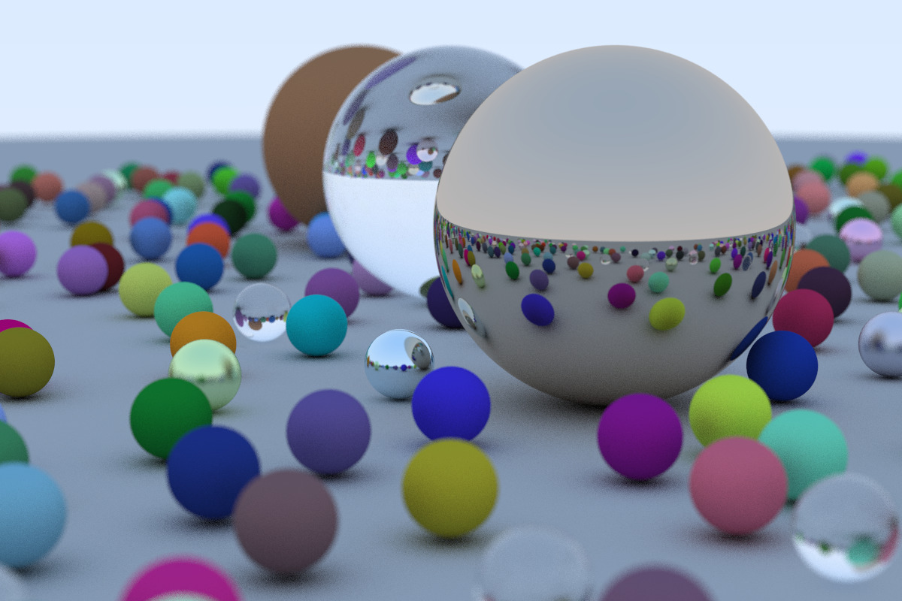
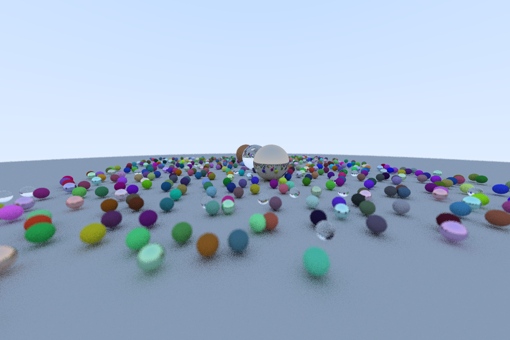
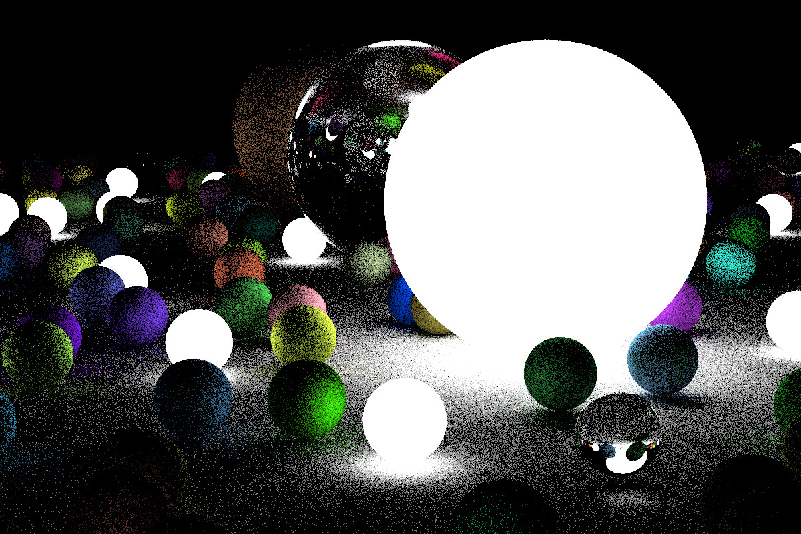

# Ray Tracing in One Weekend

A ray tracing book from [http://in1weekend.blogspot.com/2016/01/ray-tracing-in-one-weekend.html](http://in1weekend.blogspot.com/2016/01/ray-tracing-in-one-weekend.html). This reposity recorded my learning notes.


(The original .ppm picture took two hours to generate. 2.7 GHz Dual-Core Intel Core i5, 1200x800 resolution, 100 rays per pixel, 488 objects.)


(10 rays per pixel)

## Chapter 1: Output an image

将渲染结果存储到 .ppm 格式的文件中，使用 .ppm 文本格式来查看图像。

## Chapter 2: The vec3 class

对 color、location、directions、offsets 等等都使用同一个类来表示，即 `vec3`。

## Chapter 3: Rays, a simple camera, and background

所有的 ray tracer 都有的一个类就是 ray 类和一个沿着该 ray 将会看到什么颜色的计算过程。

假设一条 ray 为方程 p(t) = A + t*B。这里的 p 是 3D 中沿着一条线的一个 3D position。A 是该 ray 的原点，B 是该 ray 的方向。而 ray 的参数 t 是一个实数（代码中是浮点数）。插入不同的 t，p(t) 就会沿着该 ray 移动该点。加上负的 t，你就能够得到该 3D 线的任意一个位置了。对于正的 t，你只能得到 A 的前一部分，这通常被称为 half-line 或 ray。

Ray tracer 的核心是发送 rays 穿过 pixels，然后计算在这些 rays 的方向上看到的是什么颜色。即计算从 eye 到一个 pixel 的 ray，算出该 ray 与什么东西相交，然后算出该相交点的颜色。

## Chapter 4: Adding a sphere

人们通常在 ray tracer 中使用球体，因为计算一条 ray 和一个球体是否相交是非常直白的。一个球形位于原点且半径为 R 的球体的方程是 x\*x + y\*y + z\*z = R\*R。如果球心位于 (cx, cy, cz)，则方程为

(x-cx)\*(x-cx) + (y-cy)\*(y-cy) + (z-cz)\*(z-cz) = R\*R

在图形学中，你几乎总是想要你的公式以向量术语的形式来表示，这样所有 x/y/z 的东西都会在 vec3 class 的底层。从球心 C=(cx,cy,cz) 到点 p=(x,y,z) 的向量是 (p-C)，而点乘 dot((p-C), (p-C)) = (x-cx)\*(x-cx) + (y-cy)\*(y-cy) + (z-cz)\*(z-cz)。所以球体方程的向量形式是：

dot((p-C),(p-C)) = R\*R

我们可以读成“任意满足这个方程的点 p 都在球体上”。我们想要知道我们的 ray p(t)=A+t\*B 是否相交该球体。如果相交，则存在某些 t 使得 p(t) 满足该球体方程。所以我们对所有的 t 检查下面的方程是否为 true：

dot((p(t)-C),(p(t)-C)) = R\*R

展开 ray p(t) 的每一项，得到

dot((A+t\*B - C),(A+t\*B - C)) = R\*R

如果我们应用向量代数的规则展开该方程，并把所有的项放在左手边，我们就得到：

t\*t\*dot(B,B) + 2\*t\*dot(B,A-C) + dot(A-C,A-C) - R\*R = 0

该方程中的向量和 R 都是常量且已知，未知的是 t，且该方程是二次的。你可以解出 t，且有一个平方根项，可能为正（意味着有两个实解）、负（意味着没有实解）或者为 0（意味着有一个实解）。在图形学中，代数（algebra）几乎总是和几何（geometry）直接相关。

## Chapter 5: Surface normals and multiple objects

## Chapter 6: Antialiasing

对每个像素发送多条 ray，并取这些 ray 颜色的平均值。

## Chapter 7: Diffuse Materials

现在我们有了多个物体和每个像素有多条 ray，我们可以制作一些看起来逼真的 materials。我们会从 diffuse（磨砂 matte）materials 开始。
有一个问题是，我们是将 shapes 和 materials 融合并匹配到一起（因此我们将一个 material 赋给一个 shape）还是将它们组合到一起，这样 geometry 和 material 就能更加的紧密（这对于某些 geometry 和 material 是链接在一起的伪物体可能非常有用）。
我们选择的方法是将它们分开，这是大多数 renderer 所使用的方法，但需要意识到这种方法的限制。

漫反射物体不会发出光，只有包围它们的颜色，但它们会使用它们固有颜色进行调制。光从漫反射表面反射之后，它的方向会变得随机。
因此，如果我们发送三条 ray 到两个漫反射表面之间的裂缝中，则这三条 ray 的表现也是随机的：

这三条 ray 也可能被吸收，而不是被反射。表面越暗，吸收得就越多（这就是它为什么会暗的原因！）。实际上，任何将方向随机化的算法都会产出看起来粗糙的表面。
为了得到理想的漫反射表面，有一种已被证实的最简单的方法（在数学上接近 Lambertian cosine law）。

从单位半径球体上选取一个随机的点 s，该单位球体与相交点正切，然后从相交点 p 发送一条 ray 到随机点 s。该球心是 (p+N)。

我们还需要一个可以从以原点为中心的单位球体中选取一个随机点的方法。我们将使用最简单的方法：一个 rejection method。
首先，我们在单位立方体中选取一个随机点，其中 x、y、z 的范围都是从 -1 到 +1。如果这个随机点位于单位球体的外面，则我们不要这个随机点，然后继续随机选取。
一个 do/while 语句非常适合做这个：

```cpp
vec3 random_in_unit_sphere() {
    vec3 p;
    do {
        // [0, +2] => [-1, +1]
        p = 2*vec3(drand48(),drand48(),drand48()) - vec3(1.0,1.0,1.0);
    } while (p.squared_length() >= 1.0);
    return p;
}
```

这样得到的结果是：

注意球体底下的阴影。这个图像非常的暗，因为我们的球体每次反射只吸收了一般的能量，所以这些球体是 50% reflectors。如果你看不到阴影，不用担心，我们现在就修复它。这些球体看起来应该是非常亮的（在现实中应该为浅灰色）。这是因为几乎所有的 image viewers 都假设图像是经过伽马校正的，即那些 0 到 1 的值在被存储为字节之前会做一些变换。这么做有很多充分的理由，但为了我们的目的，我们需要意识到这一点。第一个近似，我们可以使用“gamma 2”，即把颜色提升为 1/gamma 次幂。简单起见，我们使用 1/2，即平方根：

```cpp
        col /= float(ns);
        col = vec3( sqrt(col[0]), sqrt(col[1]), sqrt(col[2]) );
        int ir = int(255.99*col[0]);
        int ig = int(255.99*col[1]);
        int ib = int(255.99*col[2]);
        std::cout <<  ir << " " << ig << " " << ib << "\n";
```

这会产出浅灰色的图像，就像我们期望的那样：

这里还有一个微妙 bug。有一些反射 ray 不是恰好在 t=0 时击中物体，而是 t=0.0000001 或者是 t=0.00000001，或者是其他的近似值，这个值是由 sphere intersector 算出来的。所以我们要忽略那些接近 0 的相交：

```cpp
    if (world->hit(r, 0.001, MAXFLOAT, red)) {
```

这就可以避免 shadow acne 的问题了，没错，就叫 shadow acne。

## Chapter 8: Metal


## Chapter 9: Dielectrics 电介质

像水、玻璃和钻石这样清澈的 material 都是电介质（dielectric）。
当光线击中这种 material，该光线会分成一束反射光和一束折射光（transmitted）。
我们将会通过在反射和折射之间随机选择且每次相交只会生成一条 scattered ray 来解决。

最难 debug 的部分是折射光。

Snell law（又称折射定律）描述了折射：

n * sin(theta) = n' * sin(theta')

其中的 n 和 n' 是折射率（refractive indices）（通常空气的折射率为 1，玻璃为 1.3 到 1.7，钻石为 2.4），而几何示意图为：

还有一个棘手的问题，当 ray 在折射率比较高的 material 中时，Snell law 没有实数解，即没有折射，所有的光都被反射了，且因为这种情况通常发生在固体内部，所以又被称为“total internal reflection”（全内反射，又称全反射）。这就是为什么当你被淹时，水和空气的交界处有时就是一面完美的镜子。折射的代码比反射的代码要复杂一点：

```cpp
bool refract(const vec3& v, const vec3& n, float ni_over_nt, vec3& refracted) {
    vec3 uv = unit_vector(v);
    float dt = dot(uv, n);
    float discriminant = 1.0 - ni_over_nt*ni_over_nt*(1-dt*dt);
    if (discriminant > 0) {
        refracted = ni_over_nt*(uv - n*dt) - n*sqrt(discriminant);
        return true;
    } else {
        return false;
    }
}
```

如果可以折射的话，电介质 material 总是会发生折射：

```cpp
class dielectric : public material {
    public:
        dielectric(float ri) : ref_idx(ri) {}
        virtual bool scatter(const ray& r_in, const hit_record& rec, vec3& attenuation, ray& scattered) const {
            vec3 outward_normal;
            vec3 reflected = reflect(r_in.direction(), rec.normal);
            float ni_over_nt;
            attenuation = vec3(1.0, 1.0, 0.0);
            vec3 refracted;
            if (dot(r_in.direction(), rec.normal) > 0) {
                outward_normal = -rec.normal;
                ni_over_nt = ref_idx;
            } else {
                outward_normal = rec.normal;
                ni_over_nt = 1.0 / ref_idx;
            }
            if (refract(r_in.direction(), outward_normal, ni_over_nt, refracted)) {  // 如果 Snell law 有实数解
                scattered = ray(rec.p, refracted);
            } else {  // 全反射，没有折射
                scattered = ray(rec.p, reflected);
                return false;
            }
            return true;
        }

        float ref_idx;
};
```

衰减总是为 1，因为玻璃表面不吸收任何东西。其中上面的 `attenuation = vec3(1.0, 1.0, 0.0)` 还会衰减掉蓝色通道，这是很难发现的颜色 bug，因为这样只会产生颜色的偏移。将衰减改为 `attenuation = vec3(1.0, 1.0, 1.0)`，看看它们之间有什么不同。

如果我们使用下列的参数进行尝试：

```cpp
list[0] = new sphere(vec3(0,0,-1), 0.5, new lambertian(vec3(0.1, 0.2, 0.5)));
list[1] = new sphere(vec3(0,-100.5,-1), 100, new lambertian(vec3(0.8, 0.8, 0.0)));
list[2] = new sphere(vec3(1,0,-1), 0.5, new metal(vec3(0.8, 0.6, 0.2)));
list[3] = new sphere(vec3(-1,0,-1), 0.5, new dielectric(1.5));
```

我们就会得到：

（读者 Becker 指出，当是反射 ray 时，该函数返回了 false，因此没有反射。它是对的，这就是为什么上面的图像中电介质球体没有反射的原因。我将这个错误保留下来而不纠正的原因是，存在一种这样的 bug，即计算出来的图像看起来很合理，但实际上却是不正确的，这就是一个这种 bug 的典型例子。这种类型的 bug 是最难发现的，因为我们人类不擅长找出我们看到的东西有什么错误，即有些图像看起来毫无违和感，实际上是错误的。）

实际上，玻璃的反射率随着视角的变化而变化，以一个陡峭的角度看向窗户，它就变成了一面镜子，即反射率增加。要计算这个过程的公式非常复杂，但几乎每个人都使用了 Christophe Schlick 的简化多项式近似：

```cpp
float schlick(float cosine, float ref_idx) {
    float r0 = (1-ref_idx) / (1+ref_idx);
    r0 = r0*r0;
    return r0 + (1-r0)*pow((1 - cosine),5);
}
```

这会产生我们完整的玻璃 material：

```cpp

```

关于介电质球体，有一个简单又有趣的技巧，即如果你使用一个负的半径，则该球体的几何形状不会受到影响，但该球体表面的法线指向了球内，因此可以将该球体当作一个气泡来制作一个空心的玻璃球体：

```diff
list[0] = new sphere(vec3(0,0,-1), 0.5, new lambertian(vec3(0.1, 0.2, 0.5)));
list[1] = new sphere(vec3(0,-100.5,-1), 100, new lambertian(vec3(0.8, 0.8, 0.0)));
list[2] = new sphere(vec3(1,0,-1), 0.5, new metal(vec3(0.8, 0.6, 0.2)));
list[3] = new sphere(vec3(-1,0,-1), 0.5, new dielectric(1.5));
+ list[4] = new sphere(vec3(-1,0,-1), -0.45, new dielectric(1.5));
```

结果：


## Chapter 10: Positionable camera

和电介质一样，相机也很难去 debug，所以我一般都是一点点地开发。首先，让我们有一个可调整的视场角 field of view（FOV）。它是你通过屏幕可以看到的角度。因为我们的图像不是正方形的，所以水平视场角和垂直视场角是不一样的。我通常使用垂直 FOV。我通常还把它指定为角度制的，并在构造函数内将它转换为弧度制的，只是个人品味（taste）。

## Chapter 11: Defocus Blur

现在，我们最后的 feature 是：*defocus blur*。注意，所有的摄影师都把这个称为“depth of field（景深）”，注意仅在朋友之间使用“defocus blur”这一术语。

## Chapter 12: Where next?

你现在有了一个很酷的 ray tracer！下一步做什么？

1. 光源：你可以通过向光源发送 shadow rays 来显式地做这个，或者也可以通过让某些物体发光来隐式地完成，光线击中其他物体后，其他物体发出 scattered ray，scattered ray 如果击中发光物体，则返回发光物体的颜色，并降低该 ray 的权重。这两种方法都能行，我是少数派，支持后者。
   
2. 三角形：大多数酷的模型都是以三角形的形式存储的。有关 model I/O 是最难实现的，几乎每个人都试图使用别人的代码来实现这个。
3. 表面纹理 Surface Textures：这可以让你像墙纸一样把图像粘贴在物体上。这是非常好实现的。
4. Solid Texture：
5. Volumes 和 Media
6. Parallelism：


