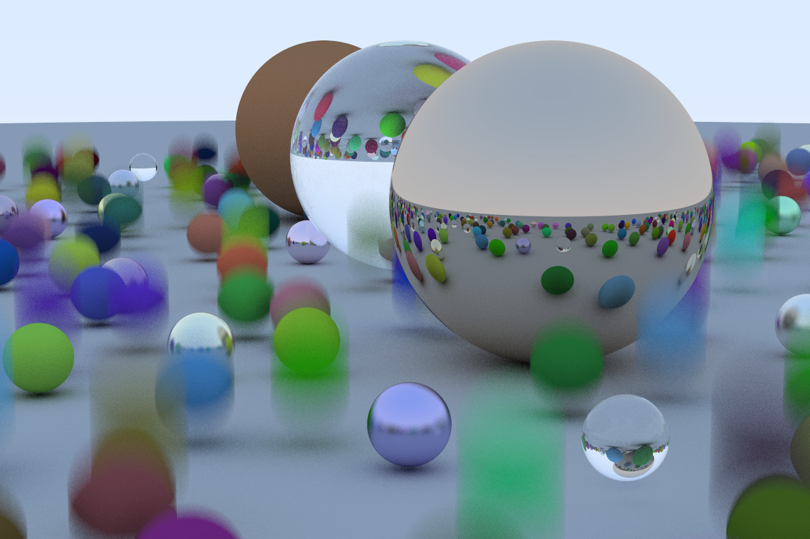

# Ray Tracing: the Next Week

在 Ray Tracing In One Weekend 中，你构建了一个简单的、蛮力的 path tracer。本期我们会添加 textures、volumes（例如雾）、rectangles、instances、lights，以及支持对许多物体使用BVH。完成后，你就有一个 “真正的” ray tracer 了。

本书最难的两部分是 BVH 和 the Perlin textures。顺序对于本书介绍的概念不是很重要，即使没有 BVH 和 Perlin texture，你也可以得到一个 Cornell Box！

## Chapter 1: Motion Blur 动态模糊

当你决定进行光纤追踪时，你会认为只要增加了视觉质量即使增加了运行时间也是值得的。在之前的 fuzzy reflection 和 defocus blur 中，你需要对每一个像素进行多次采样。一旦你采用了这种方法，好处就是几乎所有的效果都可以通过这种蛮力的方式来实现。动态模糊（motion blur）就是其中一个可以蛮力实现的效果。在真实相机中，快门会打开并在一定的时间内保持打开的状态，然后快门打开时，相机或者物体可以会移动，我们想要的是相机在这段时间内看到的东西的平局值。我们可以通过当快门打开时，在一些随机的时间点发送每条 ray 来得到一个随机的结果。只要物体在这个时间点处于正确的位置，我们就能够用一条处于单个时间点的 ray 得到正确的平均值。这就是为什么随机的 ray tracing 趋向简单的原因。

基本思想是当快门打开时，生成多条处于随机时间点的 rays，然后在这个时间点和模型相交。通常这样做的方法是让相机移动或让物体移动，但是需要准确地知道每条 ray 处于哪个时间点上。用这种方法的话，ray tracer 的“引擎”就可以确保物体确实是处于该 ray 所需要的位置，这样相交检测的那部分代码就不需要作出太大改动。

因此，我们首先需要一条存储了该 ray 存在时间的 ray：

```diff
class ray {
     public:
         ray() {}
-        ray(const vec3 &a, const vec3 &b) { A = a; B = b; }
+        ray(const vec3 &a, const vec3 &b, float ti = 0.0) { A = a; B = b; _time = ti; }

         vec3 origin() const     { return A; }
         vec3 direction() const  { return B; }
+        float time() const   { return _time; }
         vec3 point_at_parameter(float t) const { return A + t*B; }

         vec3 A;
         vec3 B;
+        float _time;
 };
```

然后，我们需要修改 camera 的代码，使其可以随机生成在 *time1* 和 *time2* 之间随机时间点的 rays。camera 应该保留对 *time1* 和 *time2* 的记录还是应该让 camera 的使用者在创建 ray 时来决定？当有分歧时，我倾向于使用可以让调用更加简单的方法，即使这样做会使构造函数复杂一点，因此我会让 camera 保存这两个值，当然，这只是个人的偏好。因为现在还并不能移动相机，所以并不需要对 camera 作出太大的改动，它只会在这个时间段发射 rays。

```diff
 class camera {
     public:
-        camera(vec3 lookfrom, vec3 lookat, vec3 vup, float vfov, float aspect, float aperture, float focus_dist) {
+        // new: add t0 and t1
+        camera(vec3 lookfrom, vec3 lookto, vec3 up, float vfov, float aspect, float aperture, float focus_dist, float t0, float t1) {
+            time0 = t0;
+            time1 = t1;
             lens_radius = aperture / 2.0;
             float theta = vfov*M_PI/180.0;
             float half_height = tan(theta/2.0);
             float half_width = aspect * half_height;
             origin = lookfrom;
             w = unit_vector(lookfrom - lookat);
             u = unit_vector(cross(vup, w));
             v = cross(w, u);
             lower_left_corner = origin - half_width*focus_dist*u - half_height*focus_dist*v - focus_dist*w;
             horizontal = 2*half_width*focus_dist*u;
             vertical = 2*half_height*focus_dist*v;
         }
         // 新增 time 来构造 ray
         ray get_ray(float s, float t) {
             vec3 rd =  lens_radius*random_in_unit_ disk();
             vec3 offset = u * rd.x() +  v * rd.y();
+            float time = time0 +  drand48()*(time1-time0);
-            return ray(origin + offset, lower_left_corner + s*horizontal + t*vertical - origin - offset);
+            return ray(origin + offset, lower_left_corner + s*horizontal + t*vertical - origin - offset, time);
         }
        
         vec3 origin;
         vec3 lower_left_corner;
         vec3 horizontal;
         vec3 vertical;
         vec3 u, v, w;
+        float time0, time1;  // 表示 shutter 开启和关闭时间的变量
         float lens_radius;
}
```

我们还需要一个移动的物体。我会创建一个 sphere class，该 sphere 的球心在 *time0* 时间处于 *center0*，在 *time1* 时间处于 *center1*，并线性移动。而在这时间段之外的时间，该球体会继续移动，因为这些之外的时间并不需要和相机光圈的开闭相匹配。

```cpp
class moving_sphere: public hitable {
    public:
        moving_sphere() {}
        moving_sphere(vec3 cen0, vec3 cen1, float t0, float t1, float r, material *m) : center0(cen0), center1(cen1), time0(t0), time1(t1), radius(r), mat_ptr(m) {};
        virtual bool hit(const ray& r, float tmin, float tmax, hit_record& rec) const;
        vec3 center(float time) const;

        vec3 center0, center1;
        float time0, time1;
        float radius;
        material *mat_ptr;
};

vec3 moving_sphere::center(float time) const {
    return center0 + ((time - time0) / (time1 - time0))*(center1 - center0);
}
```

检测是否相交的代码只需要改动一个地方：*center* 需要改成一个函数 *center(float)*：

```diff
+// 用 "center(rec.time)" 替换 "center"
 bool moving_sphere::hit(const ray& r, float t_min, float t_max, hit_record& rec) const {
-    vec3 oc = r.origin() - center;
+    vec3 oc = r.origin() - center(r.time);
     float a = dot(r.direction(), r.direction());
     float b = dot(oc, r.direction());
     float c = dot(oc, oc) - radius*radius;
     float discriminant = b*b - a*c;
     if (discriminant > 0) {
         float temp = (-b - sqrt(b*b-a*c))/a;
         if (temp < t_max && temp > t_min) {
             rec.t = temp;
             rec.p = r.point_at_parameter(rec.t);
-            rec.normal = (rec.p - center) / radius;
+            rec.normal = (rec.p - center(rec.time)) / radius;
             rec.mat_ptr = mat_ptr;
             return true;
         }
         temp = (-b +sqrt(b*b-a*c))/a;
         if (temp < t_max && temp > t_min) {
             rec.t = temp;
             rec.p = r.point_at_parameter(rec.t);
-            rec.normal = (rec.p - center) / radius;
+            rec.normal = (rec.p - center(rec.time)) / radius;
             rec.mat_ptr = mat_ptr;
             return true;
         }
     }
     return false;
 }
```

并确保 material 的 scattered ray 是处于该时间点的入射光（incident ray）。

```diff
 class lambertian : public material {
     public:
         lambertian(const vec3& a) : albedo(a) {}
         virtual bool scatter(const ray& r_in, const hit_record& rec, vec3& attenuation,  ray& scattered) const {
             vec3 target = rec.p + rec.normal + random_in_unit_sphere();
-            scattered = ray(rec.p, target-rec.p);
+            scattered = ray(rec.p, target-rec.p, r_in.time());
             attenuation = albedo;
             return true;
         }
 
         vec3 albedo;
 };
```

我们使用上一本书的最后一个场景，并使球体从它们的中心点（此时 `time=0`）移动到 `center + vec3(0, 0.5*drand48(), 0)`（此时 `time=1`），相机的光圈在该帧内始终是打开状态。

```diff
 hitable *random_scene() {
-    int n = 500;
+    int n = 50000;
     hitable **list = new hitable*[n+1];
     list[0] = new sphere(vec3(0,-1000,0), 1000,  new lambertian(vec3(0.5, 0.5, 0.5)));
 
     int i = 1;
-    for (int a = -11; a < 11; a++) {
+    for (int a = -10; a < 10; a++) {
-        for (int b = -11; b < 11; b++) {
+        for (int b = -10; b < 10; b++) {
             float choose_mat = drand48();
             vec3 center(a+0.9*drand48(), 0.2, b+0. 9*drand48());
             if ((center-vec3(4,0.2,0)).length() >  0.9) {
                 if (choose_mat < 0.8) { // diffuse
-                   list[i++] = new sphere(center, 0.2,
+                   list[i++] = new moving_sphere(center, center+vec3(0,0.5*drand48(),0), 0.0, 1.0, 0.2,
                              new lambertian(vec3 (drand48()*drand48(),  drand48()*drand48(),  drand48()*drand48() )) );
                 } else if (choose_mat < 0.95) { //  metal
                     list[i++] = new sphere(center,  0.2,
                             new metal(vec3(0.5*(1  + drand48()), 0.5*(1 +  drand48()), 0.5*(1 +  drand48())), 0. 5*drand48()));
                 } else { // glass
                     list[i++] = new sphere(center,  0.2, new dielectric(1.5));
                 }
             }
         }
     }
 
     list[i++] = new sphere(vec3(0,1,0), 1.0, new  dielectric(1.5));
     list[i++] = new sphere(vec3(-4,1,0), 1.0, new  lambertian(vec3(0.4, 0.2, 0.1)));
     list[i++] = new sphere(vec3(4,1,0), 1.0, new  metal(vec3(0.7, 0.6, 0.5), 0.0));
 
     return new hitable_list(list, i);
 }
```

然后改变视角参数：

```diff
     vec3 lookfrom(13,2,3);
     vec3 lookat(0,0,0);
     float dist_to_focus = 10.0;
-    float aperture = 0.1;
+    float aperture = 0.0;
-    camera cam(lookfrom, lookat, vec3(0,1,0), 20, float(nx)/float(ny), aperture, dist_to_focus);
+    camera cam(lookfrom, lookat, vec3(0,1,0), 20, float(nx)/float(ny), aperture, dist_to_focus, 0.0, 1.0);
```

得到




## Chapter 2: Bounding Volume Hierarchies

这一章是目前我们的 ray tracer 中最难的一部分。我把它放到了第 2 章以便代码可以尽早地运行得更快一些，且因为本章对 `hitable` 进行了重构，这样当我添加 rectangles 和 boxs 时，我们就不需要再回过头来重构它们了。

在一个 ray traver 中，ray 和物体的相交是主要的时间瓶颈，且花费的时间和物体的个数之间是线性的。但因为它在同一个模型上进行了重复的搜索，所以我们应该可以对其使用类似二叉搜索的对数搜索。因为

### Chapter 3: Solid Textures

因为 sine 和 cosine 的符号（即是正的还是负的）是有规律的替换的，所以我们可以通过它们来创建一个 checker（黑白相间）纹理。如果我们把三个维度上的三角函数都乘起来，则最后积的符号就形成了一个 3D checker 图案。

```cpp
class checker_texture : public texture {
    public:
        checker_texture() { }
        checker_texture(texture *t0, texture *t1): even(t0), odd(t1) { }
        virtual vec3 value(float u, float v, const vec3& p) const {
            float sines = sin(10*p.x())*sin(10*p.y())*sin(10*p.z());
            if (sines < 0) {
                return odd->value(u, v, p);
            } else {
                return even->value(u, v, p);
           }
        }

        texture *odd;
        texture *even;
};
```

## Chapter 4: Perlin Noise

为了得到酷炫的纯色纹理，大多数人使用各种形式的 Perlin 噪声，这些噪声是以它们的发明者 Ken Perlin 命名的。Perlin 纹理不会返回像这样的白噪声：

它返回的是模糊过的白噪声之类的东西：

Perlin 噪声的一个关键点是它是可重复的：传入一个 3D 点作为输入，它总会返回相同的随机数。相邻传入点的点会返回相似的数。Perlin 噪声的另一个关键点是，它既简单且快速，通常以 hack 的方式实现。我将基于 Andrew Kensler 的描述一步步地构建这种 hack。

我们可以用一个随机数的三维数组平铺所有的空间，然后在 block 中使用它们。如果重复规律是明显的，你将会得到一块一块的东西：

然后使用某种 hashing 来干扰它：

```cpp
class perlin {
    public:
        float noise(const vec3& p) const {
            float u = p.x() - floor(p.x());
            float v = p.y() - floor(p.y());
            float w = p.z() - floor(p.z());
            int i = int(4*p.x()) & 255;
            int j = int(4*p.y()) & 255;
            int k = int(4*p.z()) & 255;
            return ranfloat[perm_x[i] ^ perm_y[j] ^ perm_z[k]];
        }
        static float *ranfloat;
        static int *perm_x;
        static int *perm_y;
        static int *perm_z;
};

static float *perlin_generate() {
    float *p = new float[256];
    for (int i = 0; i < 256; i++) {
        p[i] = drand48();
    }
   return p;
}

void permute(int *p, int n) {
    for (int i =n-1; i > 0; --i) {
        int target = int(drand48()*(i+1));
        int tmp = p[i];
        p[i] = p[target];
        p[target] = tmp;
    }
    return;
}

static int* perlin_generate_perm() {
    int *p = new int[256];
    for (int i = 0; i < 256; i++) {
        p[i] = i;
    }
    permute(p, 256);
    return p;
}

float *perlin::ranfloat = perlin_generate();
int *perlin::perm_x = perlin_generate_perm();
int *perlin::perm_y = perlin_generate_perm();
int *perlin::perm_z = perlin_generate_perm();
```

现在我们可以创建一个传入这些 0 到 1 的浮点数的纹理，并创建一个灰色的纹理：

```cpp
class noise_texture : public texture {
    public:
        noise_texture() {}
        virtual vec3 value(float u, float v, const vec3& p) const {
            return vec3(1,1,1)*noise.noise(p);
        }
        perlin noise;
};
```

然后我们可以使用它来创建一些球体：

```cpp
hitable *two_perlin_spheres() {
    texture *pertext = new noise_texture();
    hitable **list = new hitable*[2];
    list[0] = new sphere(vec3(0, -1000, 0), 1000, new lambertian(pertext));
    list[1] = new sphere(vec3(0,     2, 0),   2, new lambertian(pertext));

    return new hitable_list(list, 2);
}
```

添加 hashing 并按预期那样进行了干扰：

为了使其平滑，我们可以使用线性插值：

```cpp
inline float trilinear_interp(float c[2][2][2], float u, float v, float w) {
    float accum = 0;
    for (int i=0; i < 2; i++) {
        for (int j=0; j < 2; j++) {
            for (int k=0; k < 2; k++) {
                accum += (i*u + (1-i)*(1-u)) *
                         (j*v + (1-j)*(1-v)) *
                         (k*w + (1-k)*(1-w)) * c[i][j][k];
            }
        }
    }
    return accum;
}

class perlin {
    public:
        float noise(const vec3& p) const {
            float u = p.x() - floor(p.x());
            float v = p.y() - floor(p.y());
            float w = p.z() - floor(p.z());

            int i = floor(p.x());
            int j = floor(p.y());
            int k = floor(p.z());
            float c[2][2][2];
            for (int di=0; di < 2; di++) {
                 for (int dj=0; dj < 2; dj++) {
                      for (int dk=0; dk < 2; dk++) {
                          c[di][dj][dk] = ranfloat[perm_x[(i+di) & 255] ^ perm_y[(j+dj) & 255] ^ perm_z[(k+dk) & 255]];
                      }
                 }
            }
            return trilinear_interp(c, u, v, w);
        }
}
```

然后我们就得到：

好了一点，但纹理还是有一些明显的网格特征。其中一些是 **Mach bands**，这是一种已知的对颜色进行线性插值时会产生的感知伪像（perceptual artifact）。一种标准的技巧是使用一个 **hermite cubic** 来对该插值进行四舍五入：

```diff
 class perlin {
     public:
         float noise(const vec3& p) {
             float u = p.x() - floor(p.x());
             float v = p.y() - floor(p.y());
             float w = p.z() - floor(p.z());
+            u = u*u*(3-2*u);
+            v = v*v*(3-2*v);
+            w = w*w*(3-2*w);
             int i = floor(p.x());
             int j = floor(p.y());
             int k = floor(p.z());
```

得到一个更加平滑的图像：

但是还是有一些低频存在。我们可以 scale 输入点使其变化得快一些：

```cpp
class noise_texture : public texture {
    public:
        noise_texture() {}
        noise_texture(float sc) : scale(sc) {}
        virtual vec3 value(float u, float v, const vec3& p) const {
            return vec3(1,1,1)*noise.noise(scale * p);
        }
        perlin noise;
        float scale;

}
```

结果：


这看起来还是存在网格块，可能是因为该图案的最小值和最大值总是准确地落在整数 x/y/z 上。Ken Perlin 的一个非常聪明的技巧是，将随机单位向量 vectors（而不仅仅是浮点数 floats）放到晶格点（lattice points）上，然后使用点乘将最小值和最大值移除该晶格。因此，首先我们需要将随机 floats 改为随机 vectors：

```cpp
vec3 *perlin::ranvec = perlin_generate();
int *perlin::perm_x = perlin_generate_perm();
int *perlin::perm_y = perlin_generate_perm();
int *perlin::perm_z = perlin_generate_perm();
```

这些向量是不规则的：

```cpp
static vec3* perlin_generate() {
    vec3 *p = new vec3[256];
    for (int i = 0; i < 256; i++) {
        p[i] = unit_vector(vec3(-1 + 2*drand48(), -1 + 2*drand48(), -1 + 2*drand48()));
    }
    return p;
}
```

现在的 Perlin class 是：

```cpp
class perlin {
    public:
        float noise(const vec3& p) {
            float u = p.x() - floor(p.x());
            float v = p.y() - floor(p.y());
            float w = p.z() - floor(p.z());

            int i = floor(p.x());
            int j = floor(p.y());
            int k = floor(p.z());

            vec3 c[2][2][2];
            for (int di=0; di < 2; di++) {
                for (int dj=0; dj < 2; dj++) {
                    for (int dk=0; dk < 2; dk++) {
                        c[di][dj][dk] = ranvec[perm_x[(i+di) & 255] ^ perm_y[(i+di) & 255] ^ perm_x[(i+di) & 255]];
                    }
                }
            }
            return perlin_interp(c, u, v, w);
        }

        static vec3 *ranvec;
        static int *perm_x;
        static int *perm_y;
        static int *perm_z;
};
```

而插值变得更加复杂了：

```cpp
inline float perlin_interp(vec3 c[2][2][2], float u, float v, float w) {
    float uu = u*u*(3-2*u);
    float vv = v*v*(3-2*v);
    float ww = w*w*(3-2*w);

    float accum = 0;
    for (int i=0; i < 2; i++) {
        for (int j=0; j < 2; j++) {
            for (int k=0; k < 2; k++) {
                vec3 weight_v(u-i, v-j, w-k);
                accum += (i*uu + (1-i)*(1-uu)) *
                         (j*vv + (1-j)*(1-vv)) *
                         (k*ww + (1-k)*(1-ww)) *
                         dot(c[i][j][k], weight_v);
            }
        }
    }
    return accum;
}
```

perlin interpolation 的输出可能是负值。该负值会传入我们的 gamma 函数中的 `sqrt()` 函数，结果然后返回 `NaN`s。我们可以把 perlin interpolation 的输出转换会 0 到 1 之间：

```diff
 class noise_texture : public texture {
     public:
         noise_texture() {}
         noise_texture(float sc) : scale(sc) {}
         virtual vec3 value(float u, float v, const vec3& p) const {
-            return vec3(1,1,1)*noise.noise(scale * p);
+            return vec3(1,1,1) * 0.5 * (1.0 + noise.noise(scale * p));
         }
         perlin noise;
         float scale;
 };
```

最后结果看起来更加合理了：


通常来说，会使用多个频率的噪声相加得到一个复合噪声。这通常被称为 **turbulence**，是重复调用 noise 的总和：

```cpp
float turb(const vec3& p, int depth=7) const {
    float accum = 0;
    vec3 temp_p = p;
    float weight = 1.0;
    for (int i = 0; i < depth; i++) {
        accum += weight * noise(temp_p);
        weight *= 0.5;
        temp_p *= 2;
    }
    return fabs(accum);
}
```

其中的 `fabs()` 是 `math.h` 中返回绝对值的函数。

如果直接使用 turbulence 的话，会产生一种伪装网状的外观（camouflage netting appearance）：


我们通常间接使用 turbulence。例如，对 solid textures 的 “Hello World” 伪纹理使用 turbulence 就得到了一个简单的类似大理石的纹理。基本思想是使颜色和类似 sine 函数的东西成正比，然后使用 turbulence 来调整相位（它会移动 sin(x) 的 x），从而生成波动的条纹。注释掉噪声和 turbulence，就可以得到一个类似大理石的效果：

```cpp
class noise_texture : public texture {
    public:
        noise_texture() {}
        noise_texture(float sc) : scale(sc) {}
        virtual vec3 value(float u, float v, cosnt vec3& p) const {
            // return vec3(1,1,1) * 0.5 * (1.0 + noise.turb(scale * p))
            // return vec3(1,1,1) * noise.turb(scale * p)
            return vec3(1,1,1) * 0.5 * (1 + sin(scale*p.z() + 10*noise.turb(p)));
        }

        perlin noise;
        float scale;
};
```

结果：


## Chapter 5: Image Texture Mapping

之前我们使用了交点 p 来索引一个像大理石那样的 procedure solid texture。我们也可以读取一个图像，然后使用一个 2D 的 (u, v) 纹理坐标来索引该图像。

一个在图像中使用 scaled 后的 (u, v) 的直接方法是对 u、v 四舍五入为整数，然后把它作为 (i, j) 像素。问题是，当我们修改了图像的分辨率时，我们不想还得去修改代码。因此，图形学中最通用的非官方标准之一是使用 **纹理坐标** 而不是像素坐标。纹理坐标只是图像的小数部分的某些形式。例如，对于 nx by ny 图像中的像素 **(i, j)**，对应的纹理坐标是：

u = i / (nx - 1)
v = j / (ny - 1)

这只是一个小数的坐标。对于一个 hitable，我们还需要在 hit record 中返回一个 **u** 和 **v**。对于球体，纹理坐标通常基于经纬度的某些形式，即球坐标。因此，如果我们在球坐标中一个 (theta, phi)，我们只需要将 **theta** 和 **phi** scale 成小数即可。如果 theta 是从极点往下的角度，而 phi 是绕着穿过极点的轴的角度，则归一化到 [0, 1] 为：

u = phi / (2*Pi)
v = theta / Pi

对于一个给定的交点，要计算该交点的 **theta** 和 **phi**，一个球心位于原点的单位球的球坐标公式是：

x = cos(phi) * cos(theta)
y = sin(phi) * cos(theta)
z = sin(theta)

我们需要对其取反。因为传某个角度的 sine 和 cosine 给可爱的 `math.h` 函数 `atan2()` 会将返回该角度，因此我们可以传入 `x` 和 `y`（cos(theta) 约掉了）：

phi = atan2(y, x)

`atan2` 返回的范围是 -Pi 到 Pi，因此我们需要小心这里。而 **theta** 的计算非常直白：

theta = asin(z)

它返回的范围是 -Pi/2 到 Pi/2。

因此，对于一个球体，它的纹理坐标计算完全可以通过一个工具函数来完成，该函数的期望是那些在球心位于原点的单位球上的东西。`sphere::hit` 内部的调用是：

```cpp
    get_sphere_uv((rec.p-center)/radius, rec.u, rec.v);
```

该工具函数为：

```cpp
void get_sphere_uv(const vec3& p, float& u, float& v ) {
    float phi = atan2(p.z(), p.x());
    float theta = asin(p.y());
    u = 1-(phi + M_PI) / (2*M_PI);
    v = (theta + M_PI/2) / M_PI;
}
```

现在我们还需要创建一个可以保存一个图像的 texture class。我打算使用我喜欢的图像工具 stb_image。它读取一个图像到一个 `unsigned char` 的大数组中。数组里的只是 packed（即 `[R1,G1,B1,R2,G2,B2,...]`） 的 RGBs，每个 RGB 的范围是 0 到 255。

```cpp
class image_texture : public texture {
    public:
        image_texture() {}
        image_texture(unsigned char *pixels, int A, int B) : data(pixels), nx(A), ny(B) {}
        virtual vec3 value(float u, float v, const vec3& p) const;

        unsigned char *data;
        int nx, ny;
};

vec3 image_texture::value(float u, float v, const vec3& p) const {
    int i = (  u) *nx;
    int j = (1-v) *ny - 0.001;

    if (i < 0) i = 0;
    if (j < 0) j = 0;
    if (i > nx-1) i = nx-1;
    if (j > ny-1) i = ny-1;

    float r = int(data[3*i + 3*nx*j]  ) / 255.0;
    float g = int(data[3*i + 3*nx*j+1]) / 255.0;
    float b = int(data[3*i + 3*nx*j+2]) / 255.0;
    return vec3(r, g, b);
}
```

一个以该顺序表示的 packed array 非常标准。幸运的是，stb_image 包使其超级简单，只要在 `main.h` 中有一个 `#define` include 该头文件即可：

```cpp
#define STB_IMAGE_IMPLEMENTATION
#include "stb_image.h"
```

从一个文件 `earthmap.jpg` 中读取图像（我只是从网上随机抓取了一个 earth map，任何一个标准的投影都可以达到我们的目的），然后将其赋值给一个 diffuse material，代码：

```cpp
int nx, ny, nn;
unsigned char *tex_data = stbi_load("earthmap.jpg", &nx, &ny, &nn, 0);
material *mat = new lambertian(new image_texture(tex_data, nx, ny));
```

所有的 colors 都是纹理，即我们可以赋任何类型的纹理给 lambertian material，而 lambertian material 不需要知道是哪种类型的纹理。

要测试的话，将该 material 赋给一个球体，然后暂时削弱 main 中的 `color()` 函数，只返回 attenuation。你应该可以得到：

